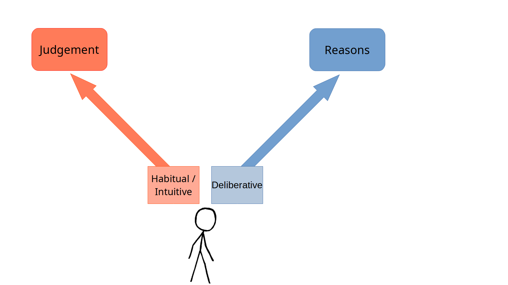
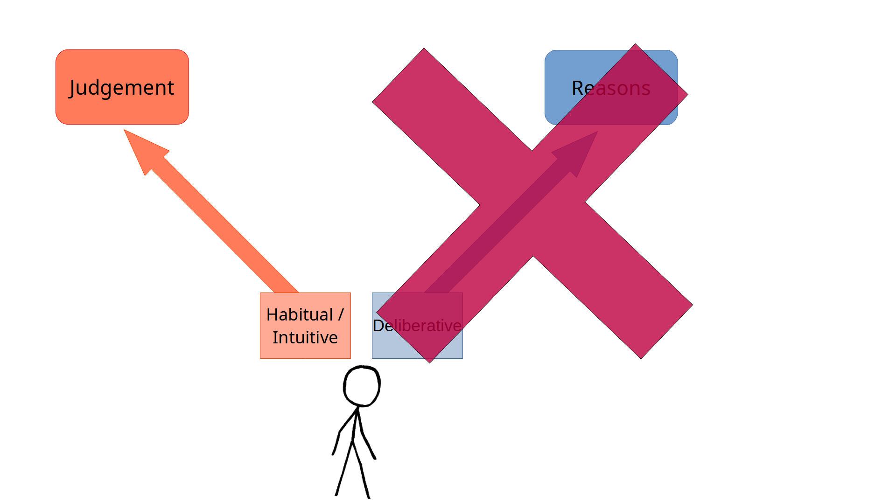
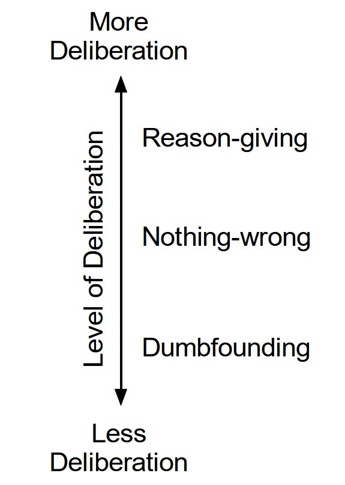
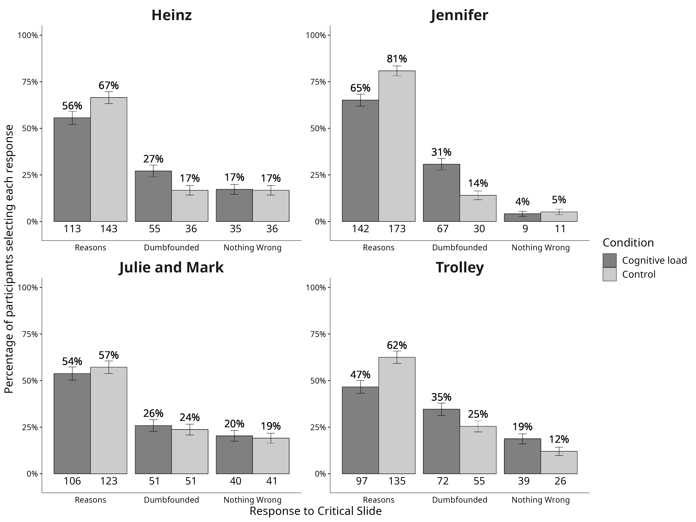
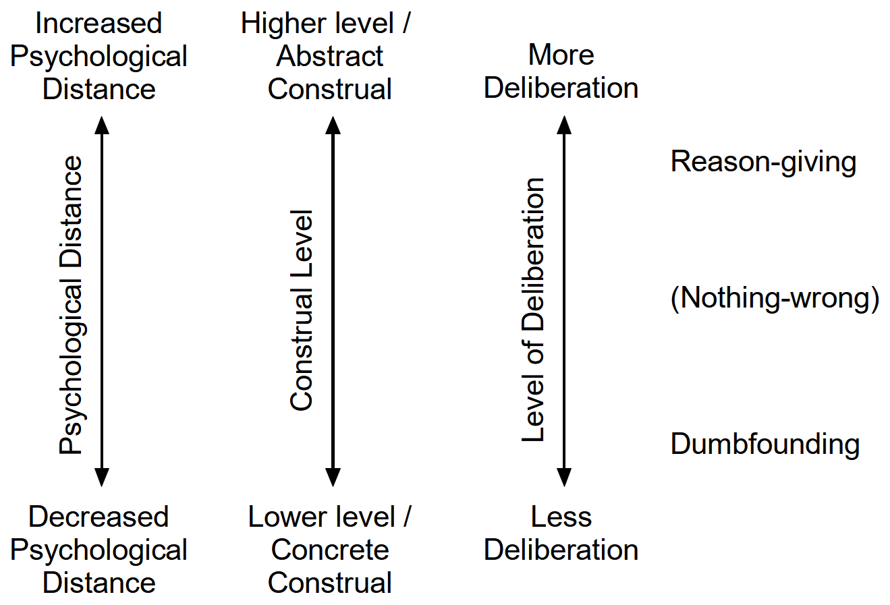
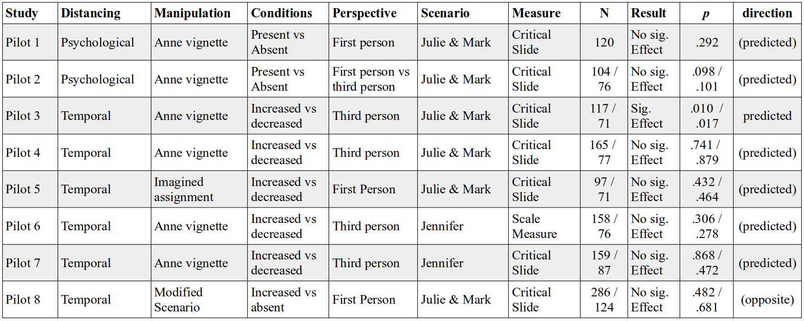

```{r ch5setup, include=FALSE}
knitr::opts_chunk$set(echo = FALSE)
knitr::opts_chunk$set(include = FALSE)
options(scipen=1, digits=2)
# knitr::opts_chunk$set(fig.path='figure/graphics-', 
#                       cache.path='cache/graphics-', 
#                       fig.align='center',
#                       external=TRUE,
#                       echo=FALSE,
#                       warning=FALSE,
#                       fig.pos='H'
# )
```

```{r load_librariesch5}
#rm(list = ls())
# install.packages("citr")
library(citr)
#install.packages("sjstats")
library(plyr)
library(foreign)
library(car)
library(desnum)
library(ggplot2)
library(extrafont)
#devtools::install_github("crsh/papaja")
library(papaja)
#library("dplyr")
library("afex")
library("tibble")
library(scales)
#install.packages("metap")
library(metap)
library(pwr)
library(lsr)
#install.packages("sjstats")
library(sjstats)
library(DescTools)
#inatall.packages("ggstatsplot")
#library(ggstatsplot)
library(VGAM)
library(nnet)
library(mlogit)
library(reshape2)
library(ggpubr)
library(gridExtra)
library(grid)
library(gghalves)


library(tidyverse)
library(flextable)
library(ftExtra)
library(officer)
library(knitr)

#devtools::install_github("benmarwick/wordcountaddin")
#library(wordcountaddin)
#wordcountaddin::text_stats("distancing_june_rw.Rmd")
getwd()
```


```{r colors}

r_slidetot <- 82


#Color Format
colFmt = function(x,color){
  outputFormat = knitr::opts_knit$get("rmarkdown.pandoc.to")
  if(outputFormat == 'latex')
    paste("\\textcolor{",color,"}{",x,"}",sep="")
  else if(outputFormat == 'html')
    paste("<font color='",color,"'>",x,"</font>",sep="")
  else
    x
}

#rgb(255, 0, 0);

sentiment <- '#ff744e'
rational1 <- '#2faace'
rational <- '#248aa8'
conflict1 <- '#7d0552'
conflict <- '#2f8d2f'
cogload <- '#a0522d'
dual <- '#b93b8f'
lightgrey <- '#c0c0c0'


# \definecolor{sentiment}{RGB}{255, 115, 115} #ff7300 or #ff744e
# 
# % \definecolor{rational}{RGB}{47,170,206} #2faace
# 
# \definecolor{rational}{RGB}{36, 138, 168} #248aa8
# 
# % \definecolor{conflict}{RGB}{125, 5, 82} #7d0552
# 
# \definecolor{cogload}{RGB}{160, 82, 45} #a0522d
# 
# \definecolor{conflict}{RGB}{47,141,47} #2f8d2f
# 
# \definecolor{dual}{RGB}{185, 59, 143} #b93b8f
# 
# \definecolor{lightgrey}{RGB}{192,192,192} #c0c0c0


# plotting:
# red dumbfounded
# yellow reasons
# blue nothing wrong
dumb_palette <- c('#ff3801','#ff4c1b','#ff6035','#ff744e','#ff8868','#ff9c81','#ffb09b','#ff744e') # https://www.colorhexa.com/ff744e
reasons_palette <- c('#ffb701','#ffbf1b','#ffc635','#ffcd4e','#ffd468','#ffdb81','#ffe39b','#ffcd4e') #https://www.colorhexa.com/ffcd4e
nothing_palette <- c('#0149ff','#1b5bff','#356eff','#4e80ff','#6892ff','#81a5ff','#9bb7ff','#4e80ff') # https://www.colorhexa.com/4e80ff


```


## Thanks for the Invitation


## Thanks for the Invitation

### About Me

- PhD in 2018
- 2018-2020: yearly teaching contracts
- 2020-2022: Editorial Manager at *Political Psychology*
- 2020-2023: teaching 5-year contract
- 2023: Tenure Track Position
- 2024: Tenured


## Thanks for the Invitation

### About Me

- PhD on Moral Dumbfounding
- Interested in Morality more generally
- ***Very*** interested in Ecological / Eco-behavioural Science (Behaviour Settings)


## Some Links{.smaller}

- [Distancing Pilot Studies](https://osf.io/qtrwm/files/gkcbr?view_only=2418b9e8e75b4655be731f69b147f233){target="_blank"}

- [Original Dumbfounding Manuscript](https://polpsy.ca/wp-content/uploads/2019/05/haidt.bjorklund.pdf){target="_blank"}

- [OSF site for current project](https://osf.io/3fuer/overview?view_only=c2b02ef663fc4a12a2c3a143c21d9776)
  - [Approved Manuscript](https://osf.io/3fuer/files/g826p?view_only=c2b02ef663fc4a12a2c3a143c21d9776)
  - [Supplementary Materials](https://osf.io/3fuer/files/ms9a3?view_only=c2b02ef663fc4a12a2c3a143c21d9776)

- Our Previous Studies:
  - [2017 Replication](https://online.ucpress.edu/collabra/article/3/1/23/112379/Searching-for-Moral-Dumbfounding-Identifying){target="_blank"}
  - [Response to challenges](https://raw.githubusercontent.com/cillianmiltown/website_quarto/main/publications/pubs/reasons-or-rationalizations/reasons-or-rationalizations.pdf){target="_blank"}
  - [Non-WEIRD contexts](https://link.springer.com/article/10.3758/s13421-022-01386-z){target="_blank"}
  - [Cognitive Load](https://online.ucpress.edu/collabra/article/9/1/73818/195829/Cognitive-Load-Can-Reduce-Reason-Giving-in-a-Moral){target="_blank"}

- [MJAC paper](https://journals.sagepub.com/doi/full/10.1177/1745691621990636){target="_blank"}


## Overview

- Background to Moral Dumbfounding
- Moral Dumbfounding & Dual Processes
- The Current Studies
- Looking Forward

## Moral Dumbfounding in the Wild{.smaller}

::::{.columns}

:::{.column width="70%"}

*“This line of thinking is morally wrong”*<br>
(US Representative discussing role of parents/schools in raising children in the House of Representatives in 2023)

<br>

*“The Bill is unnecessary and it is poorly drafted, but above all, it is deeply wrong...”*<br>
(UK Politician discussing free speech in Universities in UK Parliament in 
Higher Education (Freedom of Speech) Bill - Hansard - UK Parliament, 2021)

<br>

*“I appeal to the Minister to put this Bill on the shelves of his Department and to leave it  to become surrounded by cobwebs ... Artificial contraception is morally wrong.”*<br>
(Irish Politician discussing contraception in the Dáil in 1979)

:::

::: {.column width="30%"}

<br>


<br> 
<br> 


:::

::::
## Moral Dilemmas

:::{.incremental}
- Is it wrong to steal a drug to save a loved one?/Is it wrong to demand profit from a life saving drug?
- Is it wrong to push someone off a bridge to save five?
- Is it wrong to eat meat from a dead body?
- Is it wrong for a brother and sister (Julie and Mark) to make love? (using multiple forms of contraception)<br><br>

- <font color="#FF7575">**Have you got a reason for your Judgement?**</font>
:::

## What is Moral Dumbfounding?

. . .

Moral Dumbfounding occurs when people <font color="ff744e">defend</font> a moral judgement even though they cannot provide a <font color="6892ff">reason</font> in support of this judgment [@haidt_Moral_2000; @mchugh_Searching_2017]<br><br>

:::{.incremental}

- Admission of not having reasons 
- Unsupported declarations
  - <font size="54px" color="ff744e">"*It's just wrong *"</font>

- Typically occurs for harmless taboos

:::


## Influence of Moral Dumbfounding

- Moral Dumbfounding is cited as evidence for
  - ***`r colFmt("intuitionist",sentiment)`*** or ***`r colFmt("dual-process",dual)`*** theories of moral judgement 
    - e.g., @crockettModelsMorality2013; @cushman_Action_2013; @greene_Secret_2008; @haidt_emotional_2001
  - over more ***`r colFmt("rationalist",rational)`*** approaches
    - e.g., @kohlbergStagesDevelopmentMoral1969; @topolskiChoosingEmotionalDog2013


## Research on Moral Dumbfounding {.smaller}

::: {.fragment .fade-in fragment-index=1}
- Original unpublished study [@haidt_Moral_2000]
:::
::: {.fragment .fade-in fragment-index=2}
- Replication and development of methods [@mchugh_Searching_2017]
:::
::: {.fragment .fade-in fragment-index=3}
- Replication in non-Western samples [China, India, MENA, @mchugh_Just_2023]
:::
::: {.fragment .fade-in fragment-index=4}
- <font color="6892ff">Principle/reason</font>-based challenges [@sneddonSocialModelMoral2007; @grayMythHarmlessWrongs2014; @jacobsonMoralDumbfoundingMoral2012; @stanleyReasonbasedExplanationMoral2019]
  - @royzman_curious_2015
:::


::: {.fragment .fade-in fragment-index=6}
::: {.fragment .highlight-red fragment-index=8}
- Robust to challenges [@mchugh_Reasons_2020]
:::
:::

::: {.fragment .fade-in fragment-index=7}
::: {.fragment .highlight-red fragment-index=9}
- Dual-Processes/Cognitive Load [@mchugh_Cognitive_2023]
:::
:::


## Robust to Challenges

:::{.incremental}
- @royzman_curious_2015 exclusion criteria
  - Endorsing

- @mchugh_Reasons_2020 exclusion criteria
  - Endorsing, Articulating, *and* Applying
  
- False Exclusions
  - Selected "nothing wrong"

:::

## Robust to Challenges

![False exclusions by exclusion criteria [@mchugh_Reasons_2020]](resources/img/exclusions.png){.fragment height=500}


## Robust to Challenges

![Rates of Dumbfounding depending on exclusion criteria [@mchugh_Reasons_2020]](resources/img/S3reasonsfig2.png){.fragment height=500}


# Moral Dumbfounding & Dual Processes

## Moral Dumbfounding & Dual Processes


::: {.r-stack}
{.fragment height=450}


{.fragment height=450}
:::

## Moral Dumbfounding & Dual Processes {.smaller}


- <font color="2f8d2f">Conflict</font> in <font color="b93b8f">dual-process</font> occurs when
  - a <font color="ff744e">habitual (System 1)</font> response is <font color="2f8d2f">different</font>
  - from a response that results from <font color="248aa8">deliberation (System 2)</font>


Three response options in the <font color="2f8d2f">dumbfounding paradigm</font>

::: {.fragment .highlight-blue}
  - It’s wrong and I can provide a valid reason
  
:::
::: {.fragment .highlight-red}
  - It’s wrong but I can’t think of a reason

:::
::: {.fragment .highlight-red}
  - There is nothing wrong (competing intuitions)

:::


## Dual Processes and Dumbfounding

{height=500px}


## Moral Dumbfounding & Cognitive Load {.smaller}

- Manipulations of  <font color="a0522d">Cognitive load</font> are known to inhibit <font color="248aa8">deliberative responding</font>


- Recall the three response options in <font color="2f8d2f">dumbfounding</font>
  - <font color="248aa8">It's wrong and I can provide a valid reason (reason-giving)</font>
  - <font color="ff744e">It's wrong but I can't think of a reason (dumbfounded) </font>
  - <font color="ff744e">There is nothing wrong (competing intuitions) (nothing-wrong)</font>

**<font color="a0522d">Cognitive load</font> & dumbfounded responding**


<font color="248aa8">**&#x2193; &#x2193; &#x2193; &#x2193;** &nbsp;&nbsp; &nbsp;&nbsp;&nbsp;&nbsp;&nbsp;&nbsp;&nbsp;   Reason-giving &nbsp;&nbsp;&nbsp;&nbsp; &nbsp;&nbsp;&nbsp;&nbsp;&nbsp;&nbsp;&nbsp; **&#x2193; &#x2193; &#x2193; &#x2193;** </font>

<font color="ff744e">**&#x2191;** &nbsp;&nbsp; **&#x2191;** &nbsp;&nbsp;&nbsp;&nbsp;&nbsp;&nbsp;&nbsp;&nbsp;&nbsp;&nbsp;&nbsp;&nbsp;&nbsp;&nbsp;&nbsp; Dumbfounded  &nbsp;&nbsp;&nbsp;&nbsp;&nbsp;&nbsp;&nbsp;&nbsp;&nbsp;&nbsp;&nbsp;  **&#x2191; &#x2191; &#x2191;**</font> 

<font color="ff744e">**&#x2191;** &nbsp;&nbsp; **&#x2191;** &nbsp;&nbsp;&nbsp;&nbsp;&nbsp;&nbsp;&nbsp; &nbsp;&nbsp;&nbsp;&nbsp;&nbsp;&nbsp; Nothing-wrong &nbsp;&nbsp; &nbsp; &nbsp; &nbsp; &nbsp;&nbsp;&nbsp;&nbsp;&nbsp; **&#x2191;**</font>


## Dumbfounding and Cognitive Load{.smaller}

{height="500"}

@mchugh_Cognitive_2023


## Facilitating Deliberative Responding?

:::{.incremental}
- Reason-giving should increase under manipulations that encourage deliberative thinking
- Drawing on construal-level theory [@libermanEffectTemporalDistance2002; @forster_Temporal_2004]
  - Distancing manipulations
    - Psychological distancing
    - Temporal distancing
    - Directly manipulating construal/mindset

:::


## Moral Dumbfounding & Distancing {.smaller}

:::{.incremental}
- <font color="a0522d">Distancing</font> manipulations ***facilitate*** <font color="248aa8">deliberative responding</font> [@libermanEffectTemporalDistance2002]

- Three response options in <font color="2f8d2f">dumbfounding</font>
  - <font color="248aa8">Reason-giving (deliberative)</font>
  - <font color="ff744e">Dumbfounded (intuitive) </font>
  - <font color="ff744e">Nothing-wrong (competing intuitions)</font>

:::{.fragment}

**<font color="a0522d">Distancing</font> & dumbfounding**

<font color="248aa8">**&#x2191; &#x2191; &#x2191; &#x2191;** &nbsp;&nbsp; &nbsp;&nbsp;&nbsp;&nbsp;&nbsp;&nbsp;&nbsp;   Reason-giving &nbsp;&nbsp;&nbsp;&nbsp; &nbsp;&nbsp;&nbsp;&nbsp;&nbsp;&nbsp;&nbsp; **&#x2191; &#x2191; &#x2191; &#x2191;** </font>

<font color="ff744e">**&#x2193;** &nbsp;&nbsp; **&#x2193;** &nbsp;&nbsp;&nbsp;&nbsp;&nbsp;&nbsp;&nbsp;&nbsp;&nbsp;&nbsp;&nbsp;&nbsp;&nbsp;&nbsp;&nbsp; Dumbfounded  &nbsp;&nbsp;&nbsp;&nbsp;&nbsp;&nbsp;&nbsp;&nbsp;&nbsp;&nbsp;&nbsp;  **&#x2193; &#x2193; &#x2193;**</font> 

<font color="ff744e">**&#x2193;** &nbsp;&nbsp; **&#x2193;** &nbsp;&nbsp;&nbsp;&nbsp;&nbsp;&nbsp;&nbsp; &nbsp;&nbsp;&nbsp;&nbsp;&nbsp;&nbsp; Nothing-wrong &nbsp;&nbsp; &nbsp; &nbsp; &nbsp; &nbsp;&nbsp;&nbsp;&nbsp;&nbsp; **&#x2193;**</font>
:::
:::


## Moral Dumbfounding & Distancing


{height="500"}


## The Current Studies {.smaller}

:::{.incremental}
- 8 (Pilot) Studies
- All between-subjects design
  - Psychological Distance (increased vs control/decreased)
  - Temporal Distance (increased vs decreased/control)
- Materials
  - *Julie & Mark* (incest) scenario (Studies 1-5, & 8)
  - *Jennifer* (cannibal) scenario (Studies 6 & 7)
- Manipulations
  - "Anne" vignette / imagined assignment (Studies 1-7)
  - Modified scenario (Study 8)
  
:::


```{r apriori_power_analyses_reporting}

large <- pwr.chisq.test(w=.35,df=(3-1),sig.level = .05, power=.8)
med   <- pwr.chisq.test(w=.21,df=(3-1),sig.level = .05, power=.8)
small <- pwr.chisq.test(w=.07,df=(3-1),sig.level = .05, power=.8)

round(large$N)
# https://www.real-statistics.com/chi-square-and-f-distributions/effect-size-chi-square/

```

## A Note on Power

A priori power analysis indicated that in order to detect:

- Large effect size (*V* = .35) with 80% power requires
  - A sample of *N* = `r round(large$N)` participants
- Medium effect size (*V* = .21) with 80% power requires
  - A sample of *N* = `r round(med$N)` participants 
- Small effect size (*V* = . 07) with 80% power requires
  - A sample of *N* = `r round(small$N)` participants


## Overview of Current Studies


{height=420px}

## Overview of Current Studies


```{r}
#| label: apafg-summaryfigure
#| apa-cap: Overview of Pilot Studies 1-8.
#| apa-note: Sample sizes listed are the total samples that passed the attention checks, without exclusion based on responses to Need for Closure, followed by the sample size when excluding participants who failed the Need for Closure attention check.
#| include: true

```


## Julie and Mark Scenario {.smaller}

> Julie and Mark, who are brother and sister, are travelling together in France. They are both on summer vacation from college. One night they are staying alone in a cabin near the beach. They decide that it would be interesting and fun if they tried making love. At very least it would be a new experience for each of them. Julie was already taking birth control pills, but Mark uses a condom too, just to be safe. They both enjoy it, but they decide not to do it again. They keep that night as a special secret between them, which makes them feel even closer to each other.

## Jennifer Scenario {.smaller}

> Jennifer works in a medical school pathology lab as a research assistant. The lab prepares human cadavers that are used to teach medical students about anatomy. The cadavers come from people who had donated their body to science for research. One night Jennifer is leaving the lab when she sees a body that is going to be discarded the next day. Jennifer was a vegetarian, for moral reasons. She thought it was wrong to kill animals for food. But then, when she saw a body about to be cremated, she thought it was irrational to waste perfectly edible meat. So she cut off a piece of flesh, and took it home and cooked it. The person had died recently of a heart attack, and she cooked the meat thoroughly, so there was no risk of disease.

# The Current Studies

# Thank You for Listening

## References {.smallest}


